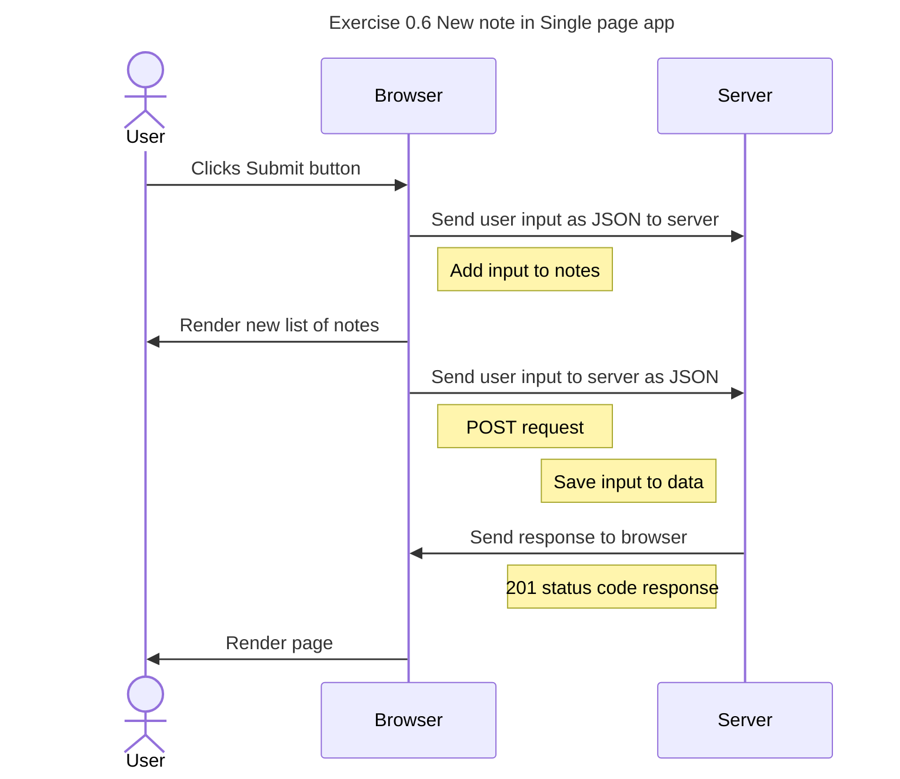

```mermaid
  sequenceDiagram
    title Exercise 0.6 New note in Single page app

      actor User
      participant Browser
      participant Server

      User->>Browser: Clicks Submit button
      Browser->>Server: Send user input as JSON to server
      note right of Browser: Add input to notes
      Browser->>User: Render new list of notes
      Browser->>Server: Send user input to server as JSON
      note right of Browser: POST request
      note left of Server: Save input to data
      Server->>Browser: Send response to browser
      note left of Server: 201 status code response
      Browser->>User: Render page
```